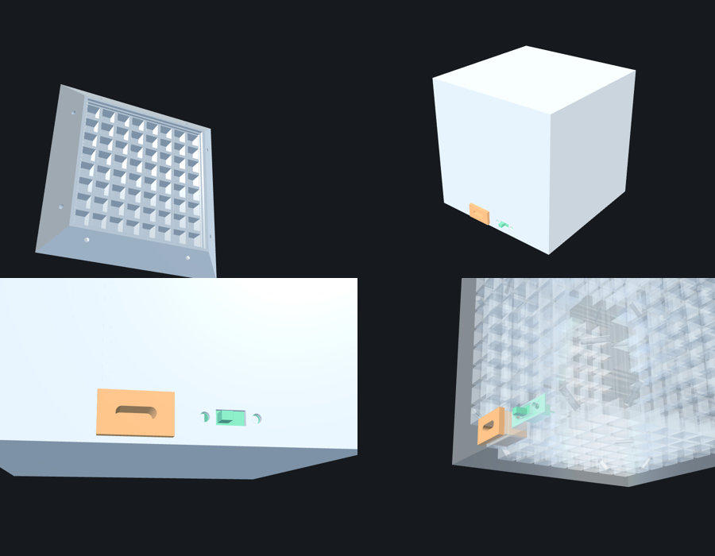

# Voxel Shell enclosure



An 89.6 mm cube built from six identical face shells with 45° mitred edges.
Each shell holds one 65 × 66 mm WS2812 8×8 panel (`../led_module.png`) in a
pocket. In front of the panel sits an 8×8 light grid and a 1.2 mm diffuser
skin, all printed as one translucent part. Every LED becomes a square pixel,
and the edges glow too.

## Files

| File | Qty | Notes |
|---|---|---|
| `shell.stl` | 4 | Plain face: top, back, left, right |
| `shell_port_front.stl` | 1 | USB-C cut-out and switch slot along its bottom edge |
| `shell_port_bottom.stl` | 1 | Matching relief for the port pockets; that edge faces the front shell |
| `fit_test.stl` | 1 | Optional, order first: a 4.9 mm slice of a shell (pocket, rim, bottom of the grid) to test-fit a real panel cheaply |
| `part_usb_c_socket.stl` | – | Reference model only (not printed) |
| `part_slide_switch_ss12f15.stl` | – | Reference model only (not printed) |
| `assembly_preview.stl` | – | All six shells assembled, for checking fit |
| `generate.py` | – | Parametric source; rebuilds every STL |
| `check_fit.py` | – | Interference checks (panels, LEDs, capacitors, parts, all panel orientations) |
| `viewer.html` | – | Interactive 3D viewer of the STLs (explode, translucent, port close-up) |

**Material:** translucent or clear resin (SLA) for all six shells. Sand or
bead-blast the outside for an even frosted diffusion.

## Bought parts

- 6 × WS2812 8×8 panel, 65 × 66 × 1.6 mm (LED grid 8.125 mm pitch, centred)
- 1 × snap-in USB-C socket with leads: flange 15.8 × 9.3 × 2.0, 9.0 deep behind the flange
- 1 × SS12F15 slide switch: plate 19.6 × 5.5, M2 holes 11.5 apart
- 2 × M2 × 4 screw + nut for the switch, or glue it in
- 24 × 2 mm dowel, about 7 mm long (1.75 mm filament works), for the mitre alignment holes

## Key dimensions

| | mm |
|---|---|
| Outer cube | 89.6 |
| PCB pocket | 65.5 × 66.5 × 1.6 (0.25 clearance per side) |
| Gap from panel back to the neighbour's edge | 1.5 (leaves a wire channel along every edge) |
| Grid walls | 1.6 thick, 0.76 clear of each LED (0.26 if the grid is 0.5 off-centre on the 66 side), stop 1.3 above the PCB (clears capacitors) |
| PCB front to diffuser skin | 7.5 |
| Clamp ring on the PCB margin | 0.6 (outer LEDs start 1.56 from the 65 mm edges) |
| USB-C cut-out | 14.6 × 8.2 in a 1.6 wall; the flange stays on the outside |
| Switch lever slot | 6.6 × 3.4 in a 1.2 wall |

`USB_CUTOUT` is an estimate: the drawing only gives the flange size. Measure
the body of your socket behind the flange and change it in `generate.py`
before ordering.

## Assembly

1. Press each panel into its shell, LEDs towards the grid. The pocket is
   65.5 × 66.5, so the 66 mm side goes along the long side of the pocket. A few dots of glue
   on the PCB rim hold it.
2. Push the USB-C socket in from outside the front port shell. Screw or glue
   the switch to the inside of the wall so its lever comes through the slot.
3. Wire the panels, ESP32 and battery. The channel along every edge (between
   panel backs and the neighbouring shells) carries wires from face to face,
   and both port pockets open into it.
4. Put dowels in the mitre holes and close the cube. Glue the last face, or
   leave it dry-fitted so the cube can be opened again.

## Viewing

Online: <https://psytraxx.github.io/gravity-cube-rs/voxel-shell/viewer.html>
(published from `case/` by `.github/workflows/pages.yml`).

Locally, browsers won't load STL files from `file://`, so serve the folder:

```bash
cd case/voxel-shell && python3 -m http.server 8000
# open http://localhost:8000/viewer.html
```

`../concepts.html` compares the five frame concepts considered (Edge Rails,
Corner Bumpers, Lantern Cage, Pinwheel, Voxel Shell) and opens directly.

## Rebuilding

```bash
pip install manifold3d trimesh numpy
python3 generate.py
python3 check_fit.py   # must end with "All checks passed."
```

All dimensions are constants at the top of `generate.py`.
